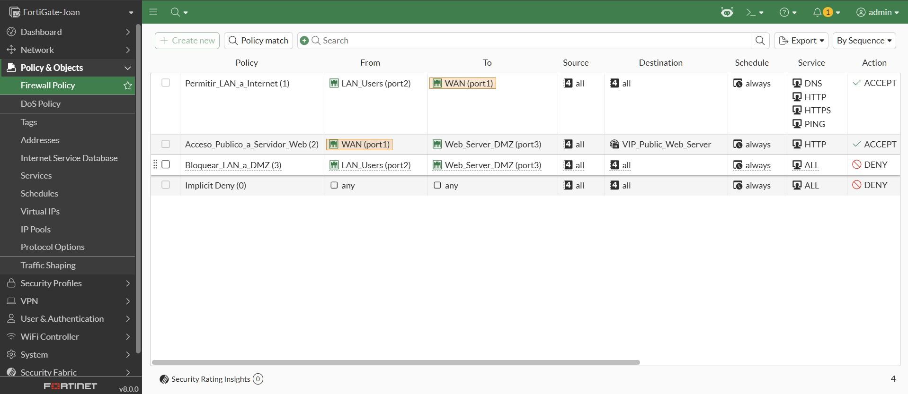
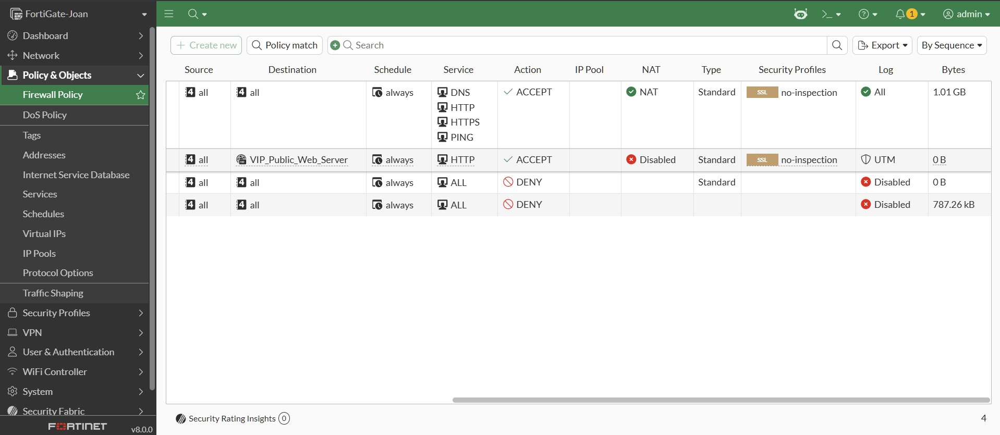
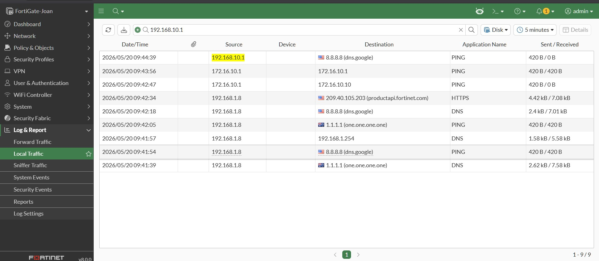

# Laboratorio Fortinet FCA: Implementación de Topología SOHO Segura con FortiGate VM

## 📝 Descripción del Proyecto
Este laboratorio práctico demuestra el despliegue y la configuración de un Firewall de Nueva Generación (NGFW) **FortiGate VM** en un entorno simulado de oficina pequeña o contingencia doméstica (SOHO). El objetivo principal es aplicar los conceptos fundamentales del nivel **Fortinet Certified Associate (FCA)**, garantizando la segmentación estricta de la red, control de acceso perimetral, traducción de direcciones de red (NAT) y la exposición segura de servicios críticos en una Zona Desmilitarizada (DMZ).

---

## 🗺️ Arquitectura y Topología de Red

El laboratorio se compone de tres segmentos de red lógicos conectados directamente a las interfaces de la máquina virtual FortiGate:

*   **WAN (Port 1):** Conectividad hacia el exterior (Internet) mediante asignación dinámica (DHCP).
*   **LAN (Port 2):** Red interna de usuarios de confianza. Segmento: `192.168.10.0/24`.
*   **DMZ (Port 3):** Zona aislada para servidores públicos. Segmento: `172.16.10.0/24`.

```text
       [ INTERNET / WAN ]
               |
         (Port 1 - DHCP)
         +-----------+
         | FortiGate |
         |    VM     |
         +-----------+
         (Port 2) (Port 3)
            |        |
            |        +--- [ Servidor Web DMZ ] (172.16.10.10:80)
            |
    [ Usuarios LAN ] (192.168.10.0/24)

````
## ⚙️ Configuración Paso a Paso (CLI de Referencia)
1. Inicialización y Direccionamiento de Interfaces
Configuración manual de los roles y direccionamiento IP para garantizar que el tráfico fluya exclusivamente por las interfaces correctas.
````
# Configuración de Interfaz WAN
config system interface
    edit "port1"
        set alias "WAN"
        set mode dhcp
        set role wan
        set allowaccess ping https
    next
end

# Configuración de Interfaz LAN
config system interface
    edit "port2"
        set alias "LAN_Users"
        set mode static
        set ip 192.168.10.1 255.255.255.0
        set role lan
        set allowaccess ping https ssh
    next
end

# Configuración de Interfaz DMZ
config system interface
    edit "port3"
        set alias "Web_Server_DMZ"
        set mode static
        set ip 172.16.10.1 255.255.255.0
        set role dmz
        set allowaccess ping
    next
end
````
2. Configuración del Servidor DHCP (LAN)
Asignación automática de direccionamiento IP para el segmento de usuarios internos.
````
config system dhcp server
    edit 1
        set interface "port2"
        set default-gateway 192.168.10.1
        set netmask 255.255.255.0
        config ip-range
            edit 1
                set start-ip 192.168.10.2
                set end-ip 192.168.10.254
            next
        end
        set dns-server1 8.8.8.8
        set dns-server2 8.8.4.4
    next
end
````
3. Publicación de Servicios mediante IP Virtual (VIP)
Mapeo perimetral para exponer el servidor web interno (TCP 80) hacia internet a través de la interfaz WAN.
````
config firewall vip
    edit "VIP_Public_Web_Server"
        set extip 0.0.0.0
        set extintf "port1"
        set portforward enable
        set mappedip "172.16.10.10"
        set extport 80
        set mappedport 80
    next
end
````
4. Políticas de Seguridad (Firewall Policies)
Aplicación de reglas basadas en el principio de menor privilegio.
````
config firewall policy
    # 1. Permitir salida de LAN a Internet con NAT
    edit 1
        set name "Permitir_LAN_a_Internet"
        set srcintf "port2"
        set dstintf "port1"
        set srcaddr "all"
        set dstaddr "all"
        set action accept
        set schedule "always"
        set service "ALL"
        set nat enable
        set logtraffic all
    next
    # 2. Permitir acceso externo al Servidor Web (DMZ) vía VIP
    edit 2
        set name "Acceso_Publico_a_Servidor_Web"
        set srcintf "port1"
        set dstintf "port3"
        set srcaddr "all"
        set dstaddr "VIP_Public_Web_Server"
        set action accept
        set schedule "always"
        set service "HTTP"
        set logtraffic all
    next
    # 3. Bloqueo explícito de LAN a DMZ (Aislamiento de Seguridad)
    edit 3
        set name "Bloquear_LAN_a_DMZ"
        set srcintf "port2"
        set dstintf "port3"
        set srcaddr "all"
        set dstaddr "all"
        set action deny
        set schedule "always"
        set service "ALL"
        set logtraffic all
    next
end
````
📊 Verificación y Resultados (Evidencias): Todo queda registrado en la carpeta **images**:

#### A. Tabla de Políticas de Seguridad (GUI)
A continuación se muestra la correcta jerarquía y estado de las políticas configuradas desde el entorno gráfico de FortiOS:



#### B. Monitoreo de Logs y Tráfico mediante CLI (Local Traffic)
*Nota de ingeniería: Debido a limitaciones de hardware para desplegar hosts finales en el hipervisor, las pruebas de conectividad se originaron directamente desde la CLI de FortiOS forzando las IPs de las interfaces como origen (`ping-options source`). Por arquitectura del sistema operativo, estas trazas se auditan bajo el módulo **Local Traffic**, demostrando el correcto enrutamiento y la aplicación de las políticas perimetrales:*


📌 Conclusiones del Laboratorio
Control Perimetral: El uso de las políticas NGFW segmentó exitosamente la red, impidiendo la comunicación directa no deseada entre la zona de usuarios y la zona de servidores.

Seguridad DMZ: Al utilizar una IP Virtual (VIP), se expone únicamente el puerto específico necesario (TCP 80) hacia internet, ocultando por completo el direccionamiento IP real de la infraestructura interna de ataques de escaneo.
