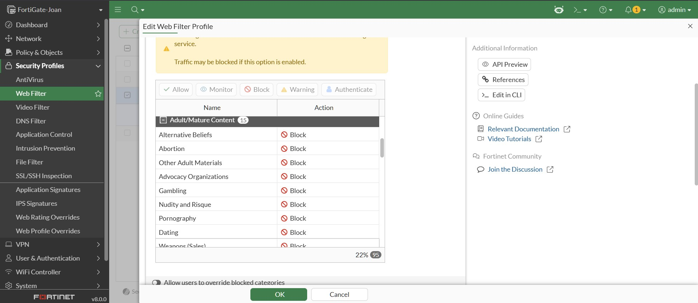
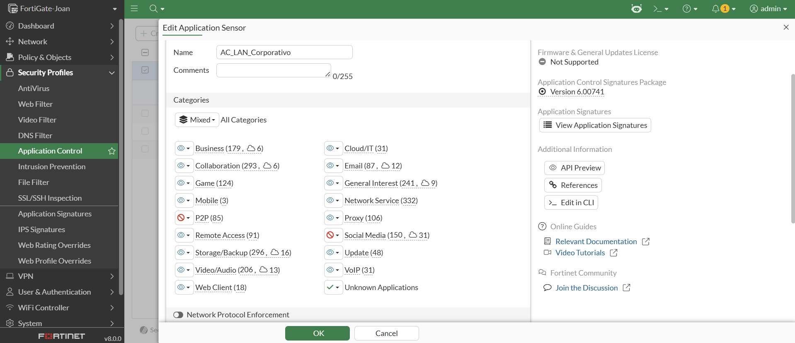
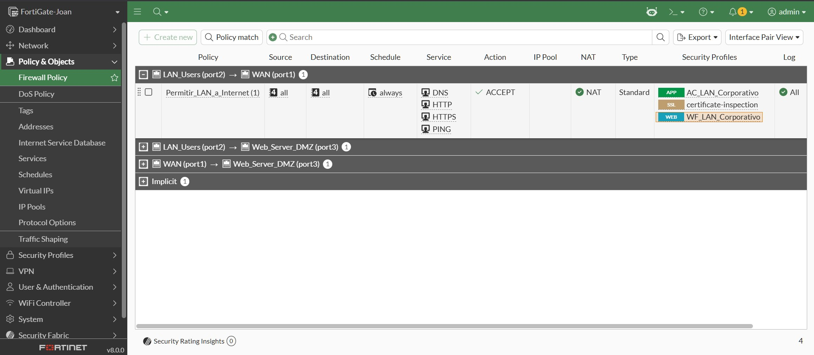
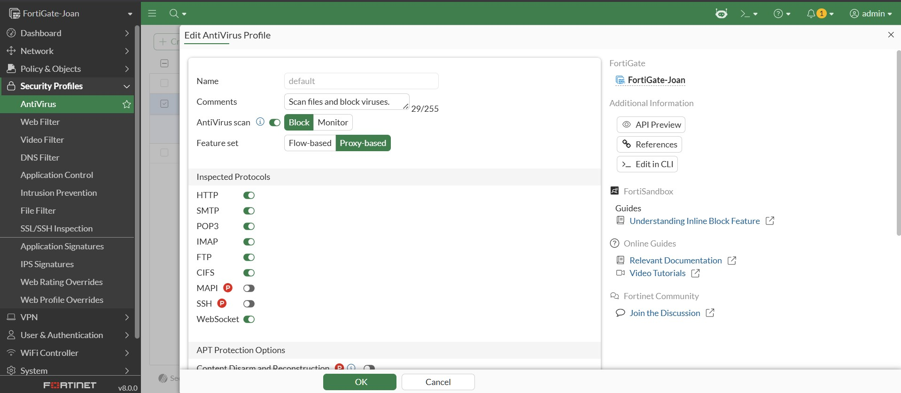
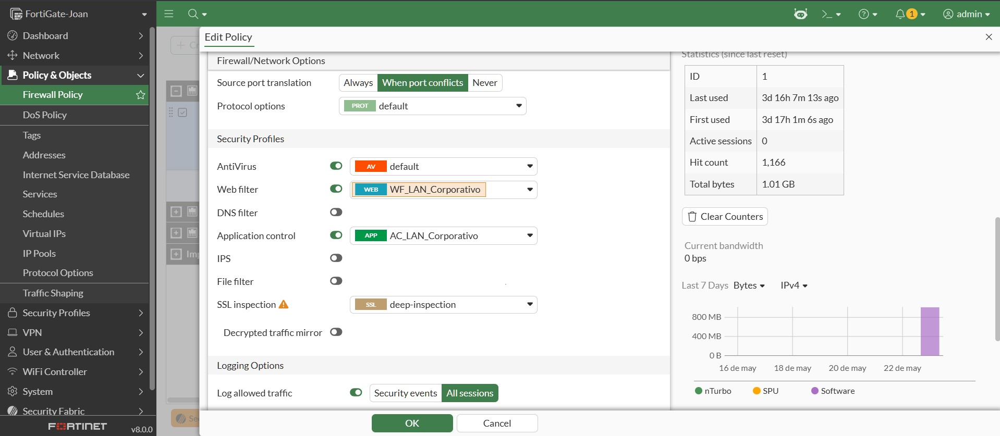
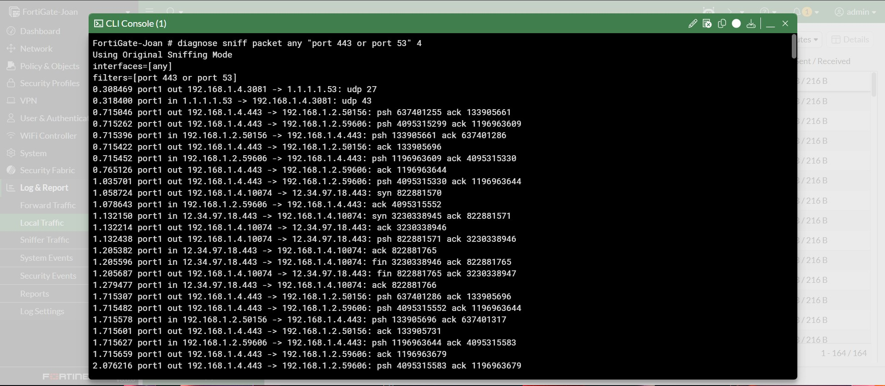
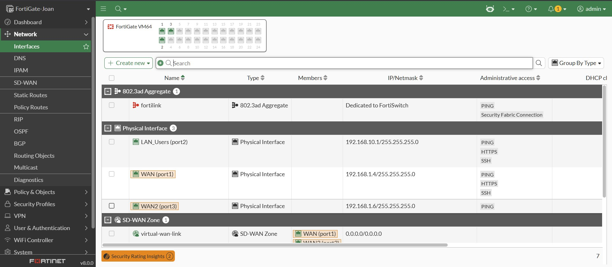
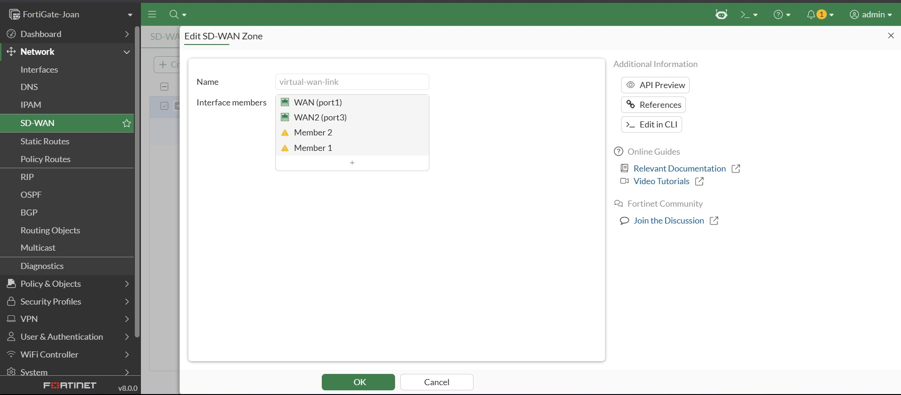
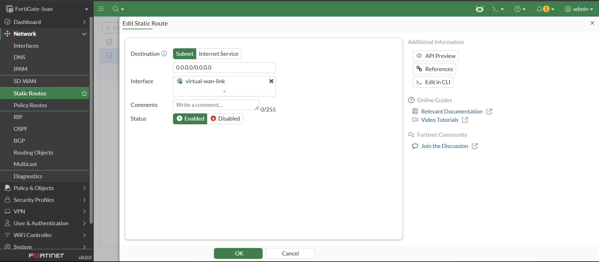
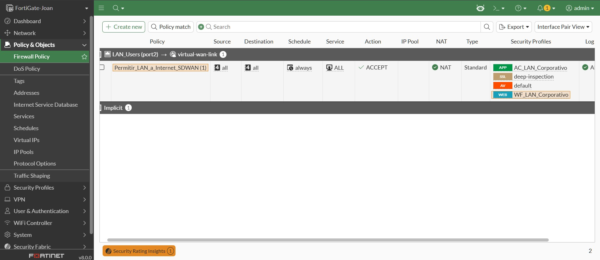

# Laboratorio Fortinet FCA: Implementación de Topología SOHO Segura con FortiGate VM

## 📝 Descripción del Proyecto
Este laboratorio práctico presenta el codiseño, despliegue y documentación de una arquitectura de seguridad perimetral y conectividad resiliente para Sucursales Conectadas (Secure Edge / Branch) utilizando una máquina virtual FortiGate VM (FortiOS v8.x).

A diferencia de los enfoques tradicionales basados únicamente en filtrado de Capas 3 y 4, este proyecto implementa políticas avanzadas de Capa 7 (NGFW) y mecanismos de alta disponibilidad lógica mediante SD-WAN. El diseño está minuciosamente estructurado y alineado con los objetivos técnicos y de arquitectura de las credenciales Fortinet Certified Associate (FCA) y Fortinet Certified Professional (FCP) en Secure Networking.

---

## 🗺️ Arquitectura y Topología de Red

El laboratorio se compone de tres segmentos de red lógicos conectados directamente a las interfaces de la máquina virtual FortiGate:

*   **WAN (Port 1):** Conectividad hacia el exterior (Internet) mediante asignación dinámica (DHCP).
*   **LAN (Port 2):** Red interna de usuarios de confianza. Segmento: `192.168.10.0/24`.
*   **DMZ (Port 3):** Zona aislada para servidores públicos. Segmento: `172.16.10.0/24`.

```text
       [ INTERNET / WAN ]
               |
         (Port 1 - DHCP)
         +-----------+
         | FortiGate |
         |    VM     |
         +-----------+
         (Port 2) (Port 3)
            |        |
            |        +--- [ Servidor Web DMZ ] (172.16.10.10:80)
            |
    [ Usuarios LAN ] (192.168.10.0/24)

````
## ⚙️ Configuración Paso a Paso (CLI de Referencia)
1. Inicialización y Direccionamiento de Interfaces
Configuración manual de los roles y direccionamiento IP para garantizar que el tráfico fluya exclusivamente por las interfaces correctas.
````
# Configuración de Interfaz WAN
config system interface
    edit "port1"
        set alias "WAN"
        set mode dhcp
        set role wan
        set allowaccess ping https
    next
end

# Configuración de Interfaz LAN
config system interface
    edit "port2"
        set alias "LAN_Users"
        set mode static
        set ip 192.168.10.1 255.255.255.0
        set role lan
        set allowaccess ping https ssh
    next
end

# Configuración de Interfaz DMZ
config system interface
    edit "port3"
        set alias "Web_Server_DMZ"
        set mode static
        set ip 172.16.10.1 255.255.255.0
        set role dmz
        set allowaccess ping
    next
end
````
2. Configuración del Servidor DHCP (LAN)
Asignación automática de direccionamiento IP para el segmento de usuarios internos.
````
config system dhcp server
    edit 1
        set interface "port2"
        set default-gateway 192.168.10.1
        set netmask 255.255.255.0
        config ip-range
            edit 1
                set start-ip 192.168.10.2
                set end-ip 192.168.10.254
            next
        end
        set dns-server1 8.8.8.8
        set dns-server2 8.8.4.4
    next
end
````
3. Publicación de Servicios mediante IP Virtual (VIP)
Mapeo perimetral para exponer el servidor web interno (TCP 80) hacia internet a través de la interfaz WAN.
````
config firewall vip
    edit "VIP_Public_Web_Server"
        set extip 0.0.0.0
        set extintf "port1"
        set portforward enable
        set mappedip "172.16.10.10"
        set extport 80
        set mappedport 80
    next
end
````
4. Políticas de Seguridad (Firewall Policies)
Aplicación de reglas basadas en el principio de menor privilegio.
````
config firewall policy
    # 1. Permitir salida de LAN a Internet con NAT
    edit 1
        set name "Permitir_LAN_a_Internet"
        set srcintf "port2"
        set dstintf "port1"
        set srcaddr "all"
        set dstaddr "all"
        set action accept
        set schedule "always"
        set service "ALL"
        set nat enable
        set logtraffic all
    next
    # 2. Permitir acceso externo al Servidor Web (DMZ) vía VIP
    edit 2
        set name "Acceso_Publico_a_Servidor_Web"
        set srcintf "port1"
        set dstintf "port3"
        set srcaddr "all"
        set dstaddr "VIP_Public_Web_Server"
        set action accept
        set schedule "always"
        set service "HTTP"
        set logtraffic all
    next
    # 3. Bloqueo explícito de LAN a DMZ (Aislamiento de Seguridad)
    edit 3
        set name "Bloquear_LAN_a_DMZ"
        set srcintf "port2"
        set dstintf "port3"
        set srcaddr "all"
        set dstaddr "all"
        set action deny
        set schedule "always"
        set service "ALL"
        set logtraffic all
    next
end
````
📊 Verificación y Resultados (Evidencias): Todo queda registrado en la carpeta **images**:

#### A. Tabla de Políticas de Seguridad (GUI)
A continuación se muestra la correcta jerarquía y estado de las políticas configuradas:


#### B. Monitoreo de Logs y Tráfico mediante CLI (Local Traffic)


📌 Conclusiones del Laboratorio 1:
* **Control Perimetral: El uso de las políticas NGFW segmentó exitosamente la red, impidiendo la comunicación directa no deseada entre la zona de usuarios y la zona de servidores.
* **Seguridad DMZ: Al utilizar una IP Virtual (VIP), se expone únicamente el puerto específico necesario (TCP 80) hacia internet, ocultando por completo el direccionamiento IP real de la infraestructura interna de ataques de escaneo.

---

## 🛡️ Laboratorio 2: Perfiles de Seguridad y Control de Aplicaciones (NGFW)

### 📝 Descripción
En esta fase se transformó el firewall perimetral básico en un **Firewall de Nueva Generación (NGFW)** mediante la implementación de inspección de Capa 7. El objetivo fue aplicar el principio de menor privilegio sobre la regla de salida a Internet (`Permitir_LAN_a_Internet`), restringiendo el acceso a categorías web de riesgo y controlando el uso de aplicaciones que comprometen la productividad y el ancho de banda.

### ⚙️ Configuración de Perfiles UTM (Arquitectura)

#### 1. Filtrado Web (Web Filter)
Se creó el perfil personalizado `WF_LAN_Corporativo` bajo la base de datos de **FortiGuard**, aplicando políticas de bloqueo estricto a las categorías de **Adult/Mature Content** para evitar contenido no deseado o de alto impacto.



#### 2. Control de Aplicaciones (Application Control)
Mediante el análisis de firmas profundas de Capa 7, se desplegó el perfil `AC_LAN_Corporativo` para denegar de forma el tráfico de las categorías **Social.Media** (firmas de Facebook, Instagram, TikTok) y herramientas **P2P** (descargas BitTorrent), previniendo la fuga de información y el abuso del canal de datos.



### 🔗 Vinculación y Motores de Inspección en la Política
Ambos escudos de seguridad fueron puestos directamente dentro de la política de firewall principal. Para asegurar la continuidad del laboratorio, se asoció el método de inspección en modo **Certificate Inspection**:



## 📌 Conclusiones del Laboratorio 2
* **Seguridad de Capa 7:** La activación de perfiles de seguridad demuestra que el firewall ya no solo inspecciona IPs y puertos (Capas 3 y 4), sino que analiza el comportamiento real del tráfico y el contenido de las peticiones.
* **Mitigación del Riesgo:** El bloqueo preventivo de categorías de reputación no deseada disminuye la superficie de ataque de la red SOHO de manera drástica, aislando los endpoints y los sitios de phishing conocidos.

---

## 🔍 Laboratorio 3: Inspección SSL/TLS Profunda (Deep SSL Inspection) y AntiVirus Perimetral

### 📝 Descripción
Este laboratorio aborda la eliminación del "punto ciego" del tráfico corporativo cifrado (HTTPS), el cual representa más del 95% de la navegación actual. Se implementó una arquitectura de tipo *Man-in-the-Middle* (MitM) controlada, delegando en el FortiGate la función de Proxy SSL para descifrar el tráfico entrante, inspeccionarlo con el motor criptográfico de FortiGuard en busca de código malicioso, y volverlo a cifrar de forma transparente antes de su entrega al endpoint.

### ⚙️ Configuración del Motor de Inspección y Seguridad

#### 1. Perfil Antivirus Corporativo en Modo Proxy
Se configuró el perfil `default` bajo un conjunto de funciones basadas en **Proxy (Proxy-based)**. Este modo es un requisito de diseño de FortiOS para realizar un análisis completo de archivos sobre los protocolos estándar de transferencia (`HTTP`, `FTP`, `CIFS`, etc.), garantizando la interrupción y el bloqueo de paquetes sospechosos o firmas de malware conocidas.

 

#### 2. Despliegue de Deep Inspection en la Política Perimetral
Se modificó la política de control de acceso a internet para alternar el análisis superficial de certificados por el perfil de **Deep Inspection**. Al acoplar el descifrado SSL junto al motor de AntiVirus, el NGFW adquiere visibilidad total sobre la Capa 7.



### Evidencia de Inspección Activa vía CLI (Sniffer)

Para verificar que el firewall está procesando las solicitudes de seguridad y comunicándose con FortiGuard para el análisis de firmas, se ejecutó un sniffer de paquetes en tiempo real:



---

## 📌 Conclusiones del Laboratorio 3
* **Eliminación del Punto Ciego HTTPS:** Sin la inspección profunda (`deep-inspection`), los perfiles de seguridad como el Web Filter o el AntiVirus quedan completamente ciegos ante ataques modernos que utilizan canales HTTPS cifrados para distribuir malware.
* **Consideraciones de Producción:** Debido a que el firewall genera certificados dinámicos firmados por su propia CA interna (`Fortinet_CA_SSL`), en un entorno empresarial real es obligatorio distribuir este certificado de manera masiva en todos los dispositivos.

---

## 🌐 Laboratorio 4: Alta Disponibilidad Perimetral y Resiliencia SOHO mediante SD-WAN

### 📝 Descripción y Restricciones del Entorno

En esta fase se aborda la continuidad de la red y la tolerancia a fallos en la red. El objetivo principal es migrar la topología SOHO desde un esquema estático con un único proveedor de Internet hacia una arquitectura altamente disponible con doble enlace gestionada de forma dinámica por el motor de **SD-WAN** de FortiOS.

#### ⚠️ Notas de Implementación en Licencia de Evaluación (FortiOS v8.x Trial)
Durante el despliegue en el entorno de evaluación, se identificaron dos restricciones críticas del sistema operativo sin licencia comercial:
1. **Límite de Interfaces Lógicas (VLANs):** FortiOS en modo *prueba* restringe la creación de subinterfaces virtuales mediante el mensaje `Maximum number of entries has been reached`. Esto impidió fragmentar el `port1`.
2. **Retención de Referencias de Hardware:** Las interfaces físicas de fábrica mantienen dependencias implícitas en la base de datos del sistema (tablas de enrutamiento, asignaciones DNS e hilos del servidor DHCP). Para asociar los puertos físicos a la zona virtual, se requiere una purga total de políticas y rutas.

**Solución Arquitectónica:** Se procedió a reestructurar la topología física reutilizando los recursos permitidos por la licencia de evaluación. Se sacrificó temporalmente el segmento físico de la DMZ (`port3`) para reconvertir dicho puerto en el **segundo enlace WAN (ISP de Respaldo)**.

---

### 🗺️ Topología Lógica Reconfigurada (SD-WAN)

                [ ISP 1 - Principal ]    [ ISP 2 - Respaldo ]
                            \                    /
                       (WAN - Port 1)       (WAN - Port 3)
                            +------------------+
                            |   ZONA SD-WAN    |
                            |(virtual-wan-link)|
                            +------------------+
                                     |
                               +-----------+
                               | FortiGate |
                               |    VM     |
                               +-----------+
                                     |
                                  (Port 2)
                                     |
                              [ Usuarios LAN ]

---

### ⚙️ Configuración del Flujo de Trabajo

#### 1. Purga de Dependencias y Reasignación de Roles
* **Eliminación de Políticas:** Se eliminaron las reglas anteriores en *Policy & Objects > Firewall Policy* para romper el bloqueo de referencias sobre el `port1` y el `port3`.
* **Reconfiguración de Puerto 3:** En *Network > Interfaces*, se editó el `port3`:
  * Se desactivó el servidor DHCP interno.
  * Se cambió el **Role** de *DMZ* a **WAN**.
  * Se configuró el **Addressing Mode** en **DHCP**.
  * Se habilitó el acceso administrativo **PING** para permitir sondeos.
 


#### 2. Orquestación de la Zona Virtual SD-WAN
* En *Network > SD-WAN > SD-WAN Zones*, se editó el contenedor virtual predeterminado **`virtual-wan-link`**.
* Se agregaron con éxito el **`port1`** y el **`port3`** como miembros activos de la zona virtual.



#### 3. Abstracción del Enrutamiento Estático
Se eliminó la antigua ruta estática hacia el `port1`. En su lugar, se creó una directiva global única en *Network > Static Routes*:
* **Destination:** `0.0.0.0/0.0.0.0`
* **Interface:** `virtual-wan-link`



---

### 📊 Monitoreo de los enlaces y cambio automático en caso de fallas

Para estar seguros de que el Internet nunca falle, se puso al FortiGate a revisar las dos conexiones todo el tiempo:
* **Prueba de conexión (SLA_Google_DNS):** El firewall se la pasa mandándole "pings" (señales de prueba) al servidor de Google (8.8.8.8) a través de ambos puertos. Así mide en tiempo real qué tan rápido responden y si se están perdiendo datos en el camino.
* **Regla de cambio automático (SD-WAN Rule):** Creamos una regla que dice que la prioridad número uno siempre la va a tener el port1 (nuestro Internet principal). Mientras esa conexión esté sana y responda bien las pruebas, toda la red de los usuarios (port2) saldrá por ahí. Pero, si el Internet principal se cae por completo o se pone muy inestable, el FortiGate pasa todo el tráfico al port3 (el Internet de respaldo) de forma automática. De esta manera, los usuarios no se enteran del daño y nunca se quedan sin señal.

---

### 🔒 Refactorización de la Política de Control de Acceso (NGFW)

La regla perimetral se reconstruyó en la sección *Firewall Policy*, enlazando los perfiles de seguridad de Capa 7 desarrollados en los laboratorios anteriores sobre la nueva interfaz virtual:

* **Name:** `Permitir_LAN_a_Internet_SDWAN`
* **Incoming Interface:** `port2` (LAN_Users)
* **Outgoing Interface:** `virtual-wan-link` (Zona SD-WAN)
* **Source / Destination / Service:** `all` / `all` / `ALL`
* **NAT:** `Enabled`
* **Security Profiles Incorporados:** 
  * **Web Filter:** `WF_LAN_Corporativo`
  * **Application Control:** `AC_LAN_Corporativo`
  * **Antivirus:** `AV-LAN-Corporativo` (Modo Proxy)
 


---

### 📌 Conclusiones del Laboratorio 4

* **Seguridad independiente de los cables:** Al conectar nuestras reglas de seguridad (como el filtro web y el antivirus) directamente a la zona de SD-WAN y no a un puerto físico, logramos que la seguridad no dependa de los proveedores. Si el día de mañana la empresa cambia de operador de Internet o contrata uno nuevo, no tenemos que volver a programar ninguna política de seguridad desde cero; el firewall sigue protegiendo todo automáticamente.
* **Internet garantizado para los usuarios:** Configurar este cambio automático basado en pruebas de "ping" reales asegura que la red nunca se quede incomunicada. Para entornos de teletrabajo o pequeñas oficinas, esto es un salvavidas, porque si el Internet principal falla, el equipo salta al de respaldo tan rápido que los usuarios ni se dan cuenta y pueden seguir trabajando sin interrupciones.
